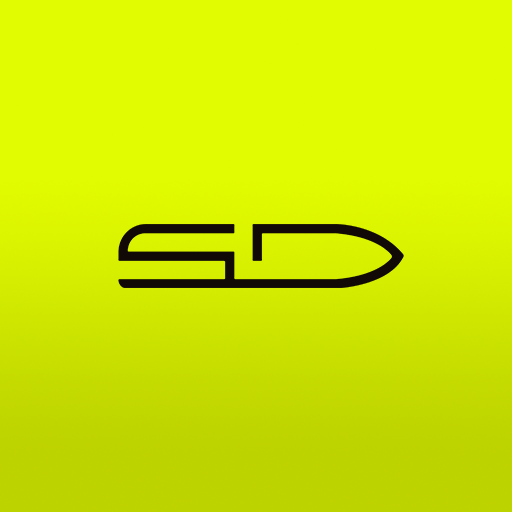

<p align="center">
  
</p>

# SMARTDOCK Website-Lokalisierung

Dieses private Repository bündelt den bestehenden Website-Quellstand und das geprüfte Lokalisierungspaket für die Erweiterung von SMARTDOCK um fünf Zielsprachen:

- Dänisch (`da-DK`)
- Spanisch (`es-ES`)
- Niederländisch (`nl-NL`)
- Norwegisch Bokmål (`nb-NO`)
- Schwedisch (`sv-SE`)

Deutsch (`de-DE`) ist der vollständige Master. Englisch und Französisch dienen ausschließlich als Bedeutungs- und Kontextreferenzen.

## Ausgangslage

Die Website verwendet mehrere nicht gleichwertige Übersetzungsmechanismen gleichzeitig: statische Wörterbücher, direkte Sprachzweige in React-Komponenten, dynamische PocketBase-Datensätze, separate Rechtstextseiten und einen teilweise wirkungslosen `Translate`-Wrapper. Dadurch lässt sich der tatsächliche Übersetzungsumfang weder aus einzelnen Wörterbüchern noch aus vorhandenen Sprachrouten zuverlässig ableiten.

Zusätzlich bestehen fachliche Konflikte, die nicht durch Übersetzung gelöst werden dürfen. Beispiele sind widersprüchliche Aussagen zur Selbstinstallation, technisch und sicherheitsrelevante Produktversprechen sowie Datenschutztexte, die gegen die produktiv eingesetzte Infrastruktur geprüft werden müssen.

## Erreichter Stand

Die sprachliche Arbeit für alle identifizierten, aktiven und browser-sichtbaren Inhalte ist abgeschlossen:

- 746 strukturierte Zielsprachzeilen mit stabilen Translation IDs
- vollständige Zielsets für DA, ES, NL, NB und SV
- globale Navigation, Homepage, Kontakt, Produkt, Funktionen und Installation
- FAQ-Seite einschließlich aller elf dynamischen FAQ-Einträge
- Händlerfinder und browser-sichtbarer Konfigurator
- Cookie-Dialog, Fehlerseite, SEO-, Alt-, ARIA- und Downloadbeschriftungen
- Barrierefreiheit, Versand/Zahlung, Widerruf, AGB, Impressum und Datenschutzerklärung
- vollständige Datenschutzerklärung mit allen Abschnitten 1–14 in fünf Zielsprachen
- lokalisierte Produktionscopy für zwei Grafikfamilien; zehn Zielgrafiken müssen noch erstellt werden

Das zentrale Arbeits- und Übergabedokument ist [SMARTDOCK_LOCALIZATION_PACKAGE.md](SMARTDOCK_LOCALIZATION_PACKAGE.md). Es enthält Mastertexte, Zielübersetzungen, Statuskennzeichnungen, Scope-Entscheidungen und die vollständige Review Queue.

## Verbindlicher Umfang

Übersetzt werden nur Inhalte, die direkt im Browser angezeigt werden. Ausgeschlossen sind:

- verlinkte oder herunterladbare PDF-Inhalte
- generierte Konfigurator-PDFs
- E-Mail-Texte und interne Servermeldungen
- ungenutzte oder alte Komponenten

Sichtbare Dokumenttitel, Downloadbuttons, ARIA-Beschriftungen und aufklappbare dynamische Website-Inhalte bleiben im Umfang. Produktnamen, Modulcodes, Marken und technische Tokens werden nicht verändert.

## Was noch fehlt

Die Übersetzungen sind sprachlich vollständig, aber noch nicht veröffentlichungsbereit. Vor dem Rollout sind folgende Arbeitsströme erforderlich:

1. Rechtliche, technische, sicherheitsbezogene, kommerzielle und markenbezogene Freigaben abschließen.
2. Widersprüche im deutschen Master verbindlich entscheiden und betroffene Zieltexte nachführen.
3. Die fünf Zielsprachen in Routing, Wörterbüchern, dynamischen Datensätzen, SEO und Barrierefreiheit implementieren.
4. Zehn lokalisierte Grafikassets produzieren und visuell prüfen.
5. Native Sprachprüfung und End-to-End-QA in allen Zielrouten durchführen.

Die konkreten Arbeitspakete werden als GitHub Issues geführt. `TARGET_REVIEW` bedeutet: Übersetzung vorhanden, Veröffentlichung erst nach der jeweils genannten Freigabe.

## Repository-Struktur

```text
apps/web/                         React-/Vite-Website
apps/api/                         API-Dienst
apps/pocketbase/                  PocketBase-Hooks und Migrationen
assets/smartdock-logo.png         Repository-Logo
SMARTDOCK_LOCALIZATION_PACKAGE.md Vollständiges Lokalisierungs- und Übergabepaket
```

Lokale `.env`-Dateien, PocketBase-Laufzeitdaten, ausführbare Binärdateien und ausgeschlossene PDFs werden nicht versioniert.

## Lokale Entwicklung

Voraussetzungen: eine zur `.nvmrc` passende Node.js-Version und npm.

```bash
cp apps/api/.env.example apps/api/.env
npm install
npm run dev
```

Benötigte Zugangsdaten werden ausschließlich lokal oder über die jeweilige Deployment-Umgebung bereitgestellt.
